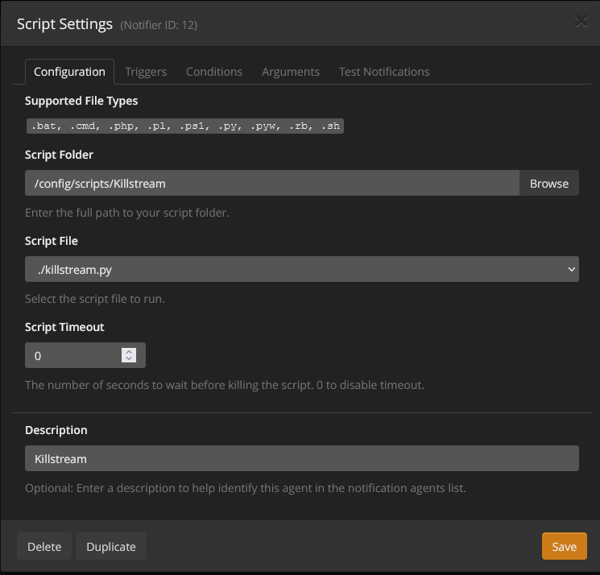
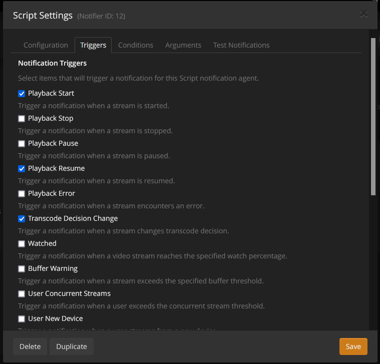
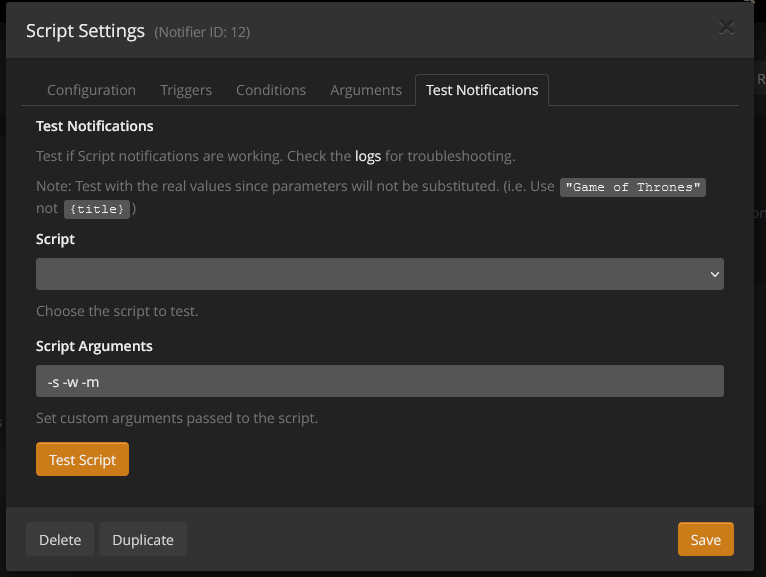

# Plex kill transcode streams

This script allows you to stop streams that use trancoding.
Prohibits the use of plex web and Plex Media Player.
Allow all users to transcode for SD streams

### Requirements

Python3 / requests (usually included with python3)<br>
Tautulli (fantastic app that you should be using and must for this script anyway)<br>
PlexPass


## Method 1 : run a shell script in background

The script checks every 20 seconds streams activities.

### Install requirements :

run

   ```shell
   user:~/plex-kill-transcode-streams$ sudo pip install -r requirements.txt
   ```

### Edit the bash script (KillstreamLoop.sh):

In this file you need to edit this line: "cd /YOURPATH/killstreamloop.sh && python3 killstream.py" <br>
Specifically you need to edit this part: "/YOURPATH/Tautulli_IP_Enforcer" <br>

### To allow accounts to transcode:

Edit the file "authorized.txt" and add the username id followed by a semicolon and the limit of unique IP addresses that are allowed. <br>For example:<br><br>52252389<br>56428612<br><br>will allow 2 precise accounts to transcode streams for this Plex server. If a user is not in the text file then they can't transcode streams. They have to use direct stream or direct play.


## Method 2 : Tautulli run itself the script  :

Tautulli run the script when a stream starts, resumes or when a stream changes its transcode decision.

### Install requirements

   ```shell
   user:~/plex-kill-transcode-streams$ sudo pip install -r requirements.txt
   ```


<p align="center">
  
</p>

<p align="center">
  
</p>
<p align="center">
  
</p>

## Method 3 : Run as docker

### Docker run

Edit environment variables and volume
```shell
user:~/plex-kill-transcode-streams$ docker build -t stoptranscode .
user:~/plex-kill-transcode-streams$ docker run -e TAUTULLI_PORT=8080 -e TAUTULLI_IP=x.x.x.x  -e TAUTULLI_API=YOURAPIKEY   -v /home/data:/data stoptranscode
```

### Docker compose

Edit docker-compose.yml and run 

```shell
user:~/plex-kill-transcode-streams$ docker-compose up -d
```


<br><br><br>
Script based on https://github.com/Dosk3n/Tautulli_IP_Enforcer
